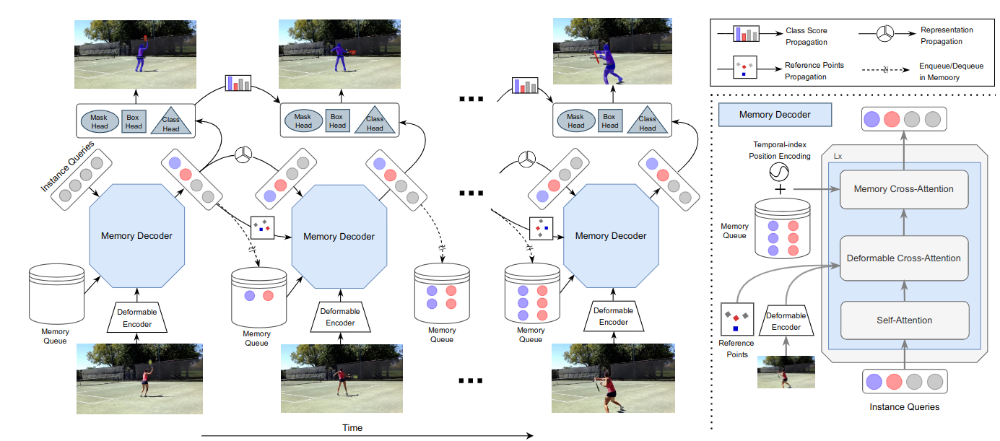
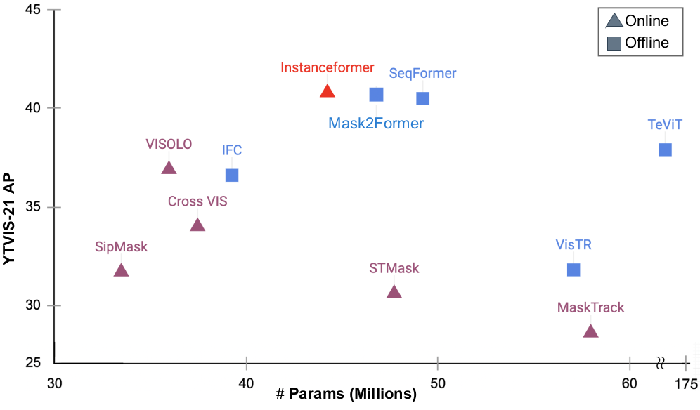

# InstanceFormer
[](https://arxiv.org/abs/2208.10547)
[](https://paperswithcode.com/paper/instanceformer-an-online-video-instance)

<p align="left"></p> 

This is an official Pytorch implementation of our AAAI 2023 paper [InstanceFormer: An Online Video Instance Segmentation Framework](https://arxiv.org/abs/2208.10547v1). In this repository, we provide PyTorch code for training and testing our proposed InstanceFormer model. InstanceFormer is an efficient video instance segmentation and tracking model that achieves state-of-the-art results on several benchmarks, such as [YTVIS-19/21/22](https://youtube-vos.org/) and [OVIS](https://songbai.site/ovis/).


<p align="center"></p>


# Installation
First, install PyTorch 1.7 and Torchvision 0.8 and compile CUDA operators. Then, install Detectron2 following the official guide: [INSTALL.md](https://github.com/facebookresearch/detectron2/blob/master/INSTALL.md).
*Please use Detectron2 with commit id [9eb4831](https://github.com/facebookresearch/detectron2/commit/9eb4831f742ae6a13b8edb61d07b619392fb6543) if you have any issues related to Detectron2.*
```bash
conda install pytorch==1.7.1 torchvision==0.8.2 -c pytorch
pip install -r requirements.txt
pip install git+https://github.com/youtubevos/cocoapi.git#"egg=pycocotools&subdirectory=PythonAPI"
conda install -c fastai opencv-python-headless
#CUDA
cd ./models/ops
sh ./make.sh
python test.py
```


# Data Preparation

Download and extract [OVIS](https://songbai.site/ovis/index.html), 
[YTVIS-19](https://youtube-vos.org/challenge/2019/), 
[YTVIS-21](https://youtube-vos.org/challenge/2021/),
[YTVIS-22](https://youtube-vos.org/challenge/2022/),
and [COCO](https://cocodataset.org/) 2017 datasets. 
Run coco_keep_for_ovis.py and coco_keep_for_ytvis21.py. 
Download 'coco_keepfor_ytvis19.json' to the datasets folder from this [link](https://drive.google.com/file/d/1dhfxtnu0oiolNyOWjf4CscBgb_tNg-K8/view?usp=sharing).

## Directory Structure
```python
InstanceFormer
├── datasets
│   ├── coco_keepfor_ytvis19.json
...
ytvis
├── train
├── val
├── annotations
│   ├── instances_train_sub.json
│   ├── instances_val_sub.json
coco
├── train2017
├── val2017
├── annotations
│   ├── instances_train2017.json
│   ├── instances_val2017.json
```
# Run 
## Pretraining
First, pre-train the InstanceFormer with the [COCO](https://cocodataset.org/) dataset with frame size 1, or use the pretrained model weight (r50_pretrain.pth) available at this [link](https://drive.google.com/drive/folders/1uAvjjIukcugt7JkCK8KiHQnnoJd0Hgsj?usp=sharing).

```bash
bash configs/r50_pretrain.sh
```
## Training
All models of InstanceFormer are trained on four NVIDIA RTX A6000 GPUs with a total batch size of 16.
To train InstanceFormer on [YouTubeVIS](https://youtube-vos.org/dataset/vis/) and [OVIS](https://songbai.site/ovis/index.html)  with 4 GPUs , run:
```bash
bash configs/train_r50_ytvis.sh
bash configs/train_r50_ovis.sh
```

To train InstanceFormer on multiple nodes, run:
```bash
MASTER_ADDR=<IP address of node 1> NODE_RANK=1 GPUS_PER_NODE=4 ./tools/run_dist_launch.sh 16 ./configs/train_r50_ytvis.sh
```
The model trained on [YTVIS-21](https://youtube-vos.org/challenge/2021/) is used to evaluate [YTVIS-22](https://youtube-vos.org/challenge/2022/) as they share the same training dataset. The trained model weights are available at this [link](https://drive.google.com/drive/folders/1uAvjjIukcugt7JkCK8KiHQnnoJd0Hgsj?usp=sharing).

## Inference & Evaluation
```bash
bash configs/evaluate_r50_ytvis.sh
bash configs/evaluate_r50_ovis.sh
```

## Automatic Upload to Server
To simplify the laborious process of manually uploading result files to the [Codalab](https://codalab.lisn.upsaclay.fr/) server, we offer an automatic uploading functionality in the file [Server Process](util/server_process.py). This functionality can be activated during [Inference](inference.py) by adding the --upload_file flag. 
## Create Plots & Videos
During [Inference](inference.py), use the --analysis flag to save reference points, sampling locations, and instance embeddings. Run [Analysis](util/analysis.py), [TSNE](util/tsne.py), and [Make Video](util/make_video.py) to save the respective plots and videos.

# Citation
If you find InstanceFormer useful in your research, please use the following BibTeX entry as a citation.

```BibTeX
@article{koner2022instanceformer,
  title={InstanceFormer: An Online Video Instance Segmentation Framework},
  author={Koner, Rajat and Hannan, Tanveer and Shit, Suprosanna and Sharifzadeh, Sahand and Schubert, Matthias and Seidl, Thomas and Tresp, Volker},
  journal={arXiv preprint arXiv:2208.10547},
  year={2022}
}
```

# Acknowledgement

We acknowledge the following repositories from where we have inherited code snippets.

1. DETR: [[code](https://github.com/facebookresearch/detr)][[paper](https://arxiv.org/abs/2005.12872)]
2. Deformable-DETR: [[code](https://github.com/fundamentalvision/Deformable-DETR)][[paper](https://arxiv.org/abs/2010.04159)]
3. SeqFormer: [[code](https://github.com/wjf5203/SeqFormer)][[paper](https://arxiv.org/abs/2112.08275)]
4. VisTR: [[code](https://github.com/Epiphqny/VisTR)][[paper](https://arxiv.org/abs/2011.14503)]
